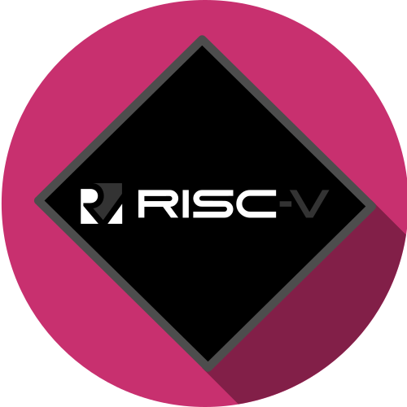

<h1 align="center">
   
  
   
  RISC-V Interpreter
   
</h1>
A [fork](https://www.cs.cornell.edu/courses/cs3410/2019sp/riscv/interpreter/) from RISC-V Interpreter in Javascript.

# Thanks
* Cornell Class CS3410 - Computer System Organization and Programming
* Danny Qiu for the creation of the ogiginal MIPS Interpreter
